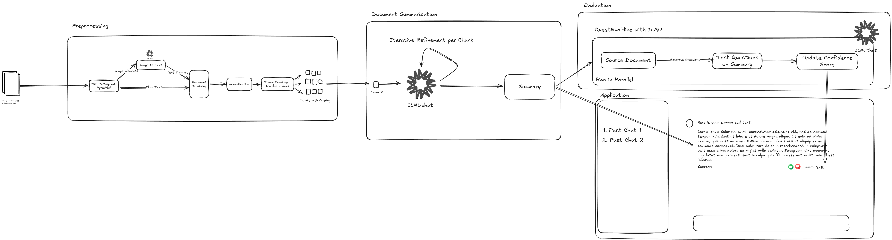
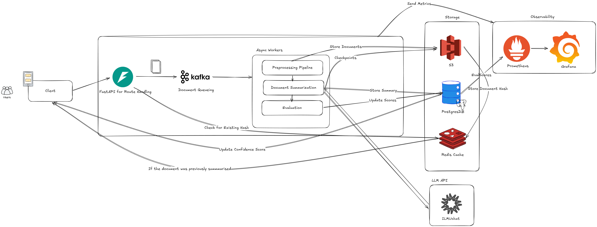

# YTL AI LABS Tech Assessment

**Candidate:** Marcus Ong Ge Ye
**Date:** 9th March 2026


---

# Q1:
```
from typing import Any, Dict, List, Tuple
def validate_tool_call(payload: Dict[str, Any]) -> Tuple[Dict[str, Any], List[str]]:
    """
    Returns (clean, errors). 'clean' strictly follows the schema with defaults applied.
    - Trim strings; coerce numeric strings to ints.
    - Remove unknown keys.
    - If action=='answer', ignore 'q' if present (no error).
    - On fatal errors (e.g., missing/invalid 'action', or missing/empty 'q' for search), return ({}, errors).
    """
    errors = []
    clean = {}

    ## Action Validation
    raw_action = payload.get("action")          # avoid KeyError on direct access
    if raw_action is None:
        return {}, ["Missing required field: 'action'"]
    if not isinstance(raw_action, str):
        return {}, [f"'action' must be a string, got {type(raw_action).__name__}"]
    action = raw_action.strip().lower()         # normalize before membership check
    if action not in ("search", "answer"):
        return {}, [f"'action' must be 'search' or 'answer', got {raw_action!r}"]

    clean["action"] = action

    ## K Validation
    raw_k = payload.get("k")                   # None if absent, k is fully optional
    if raw_k is None:
        pass                                    # omit k from clean entirely
    else:
        if isinstance(raw_k, bool):            # bool subclasses int IMPORTANT
            errors.append(f"'k' must be an integer, got bool ({raw_k!r}); using default 3")
            coerced_k = 3
        elif isinstance(raw_k, int):
            coerced_k = raw_k
        elif isinstance(raw_k, str):
            stripped = raw_k.strip()
            try:
                coerced_k = int(stripped)
            except ValueError:                 # e.g. "few", "3 results"
                errors.append(f"'k' could not be coerced to int ({raw_k!r}); using default 3")
                coerced_k = 3
        elif isinstance(raw_k, float):
            if raw_k.is_integer():             # e.g. 3.0 = 3
                coerced_k = int(raw_k)
            else:                              # e.g. 3.9 = reject
                errors.append(f"'k' is a non-integer float ({raw_k!r}); using default 3")
                coerced_k = 3
        else:                                  # list, dict, etc.
            errors.append(f"'k' has unexpected type {type(raw_k).__name__!r}; using default 3")
            coerced_k = 3

        if not (1 <= coerced_k <= 5):          # pull to nearest boundary
            errors.append(f"'k' must be in [1, 5], got {coerced_k}; clamping to range")
            coerced_k = max(1, min(5, coerced_k))

        clean["k"] = coerced_k

    ## Q Validation
    if action == "search":
        raw_q = payload.get("q")
        if raw_q is None:
            return {}, ["'q' is required when action is 'search'"]
        if not isinstance(raw_q, str):
            return {}, [f"'q' must be a string, got {type(raw_q).__name__}"]
        q = raw_q.strip()
        if not q:                              # catches "   " after strip
            return {}, ["'q' must be a non-empty string"]

        clean["q"] = q                         # q will be ignored if action == "answer" silently

    return (clean, errors)
```


---

# Q2: Searchable Knowledge Base Chatbot for Customer Support

## 1. Document Ingestion

**Parsing:** Rather than a strict two-stage pipeline, a unified hybrid parser like MinerU, LightOnOCR-2 or Azure Document Intelligence handles layout detection and content extraction in a single pass, outputting Markdown that preserves structural hierarchy. Where a VLM is still needed for complex visuals, it must receive the surrounding page context alongside the image to fully capture the image context. For low-confidence or corrupted outputs, the system should automatically reroute to a general-purpose OCR fallback before flagging for human review.

**Chunking:** Hierarchical chunking is the most natural fit for customer support, a summary chunk retrieves quickly, and the detail related is fetched on demand, which mirrors how support knowledge bases are actually structured. Chunk boundaries should be validated empirically against a held-out question set rather than assuming a token size is correct. Semantic Chunking can be used if needed depending on business context.

**Metadata Enrichment:** Every chunk should be tagged with department, product line, document version, and security tier. The payoff is pre-retrieval filtering. This helps restricting the search space before the vector search even runs, improving both precision and latency. The schema must be defined before ingestion begins, as adding fields later requires full re-ingestion.

**Embedding:** A domain-adapted model fine-tuned on support ticket history will consistently outperform a general-purpose model on specialised terminology. Ingestion architecture should match corpus dynamics, an async queue for weekly updates, GPU-accelerated batch inference for near real-time corpora. Embedding model upgrades require full corpus re-embedding and should be treated as planned migrations.


## 2. Storage and Retrieval

**Vector Database:** Amongst Qdrant, Milvus, pgvector, and Pinecone, Weaviate is the strongest fit for an enterprise customer support deployment. It offers native hybrid search, strong multi-tenancy support, and metadata filtering built in as priority features rather than bolted on, which are all non-negotiable requirements for highly accurate customer support.

**Hybrid Search:** Hybrid search combining regular retrieval, BM25 keyword search, and metadata pre-filtering would be the best approach as retrieval alone misses exact terms like product codes and BM25 keyword alone has no semantic understanding. Results are fused using Reciprocal Rank Fusion (RRF), which provides the best top-k chunks amongst the different retrieval systems.

**Multi-Tenant Isolation:** For any documents with PII or regulated data, separate indices per tenant with RBAC enforced at the API gateway would be the approach. 


## 3. Answer Generation

**Retrieval-Augmented Generation** Retrieved chunks are passed to the LLM as context alongside the query. The system prompt explicitly instructs the model to answer only from the provided context and to state when the answer is absent, this is helps to eliminate hallucinations in a setting where a wrong answer carries real legal consequences.

**Reranking:** Before prompt construction, a cross-encoder reranker like Cohere Rerank or Zerank 2 or compresses the initial K=20–50 retrieved candidates down to three to five high-precision chunks. This directly improves answer quality while reducing cost and context noise.

**Agentic Reasoning:** A ReAct agent is reserved for multi-hop queries requiring evidence across multiple documents. The majority of support queries should be routed through single-shot RAG as agentic loops add latency and cost that most queries do not justify.

**Validation:** Every response is evaluated using RAGAS, tracking faithfulness, context relevance, and answer correctness. A drop in context relevance points to a retriever problem. A drop in faithfulness points to a generator problem. Separating these two signals is what allows targeted fixes rather than retuning the entire pipeline blindly.

---

# Q3: English & Malay Document Summariser

## 1. Preprocessing

Working with long documents in two languages is a relatively new and unexplored space for me. However, through my research experience and work with AI, this would be my approach. Given the uncertainty of whether the long documents would be in English, Malay, or both, and whether the summaries would be required in one or both languages, I will assume both languages on both ends.

The first step in the pipeline is text extraction, where raw content is pulled from source documents. For plain text documents, standard PDF parsing libraries are sufficient. The extracted text is then cleaned by stripping headers, footers, and other boilerplate elements that may cloud relevant content during the summarization process.

For documents containing images, figures, and captions. The PDF parser extracts the raw visual elements which are then passed to a multimodal LLM such as ILMUchat or GPT-4o for semantic interpretation,as standard OCR tools lack the understanding needed to interpret visual content meaningfully, particularly in a Malaysian context. While the technical details of their vision encoders are not publicly disclosed, both have demonstrated stronger performance in Malaysian cultural contexts and can be empirically tested for this purpose. Fine-tuning these models on domain-specific documents, such as legal, medical, or government corpora, could further improve extraction accuracy depending on the nature and complexity

The text then undergoes normalization. Malay informal text presents unique challenges including abbreviations (e.g., jap, tak, dah), dialectal variations, and Romanized Arabic expressions, all of which must be standardized before any meaningful summarization can occur. Additionally, the presence of non-romanized scripts such as Jawi or Chinese characters introduces further complexity — these can either be transliterated to their romanized equivalents (Jawi to Rumi in the case of Malay) or translated to English where necessary. Research from the Jawi AI Project (NUS) has shown that fine-tuned vision-language models such as Qwen2.5-VL can achieve as low as 7% character error rate in Jawi OCR tasks, outperforming commercial models that frequently hallucinate incorrect transcriptions. Given ILMU's state-of-the-art performance on MalayMMLU (87.20%), it stands as a strong candidate for such fine-tuning, combining deep Malay linguistic understanding with script-level recognition. Throughout normalization, lists or custom NER methods can be used to preserve Malaysian named entities, including government acronyms such as KWSP and JPJ, place names, and culturally specific terms, which generic text normalizers may incorrectly strip or expand.

For long documents that exceed model context limits, a chunking strategy is applied. A sliding window or semantic chunking approach splits the document into overlapping segments, preserving contextual continuity across chunk boundaries. For semantic chunking of Malay text, standard embedding models trained on English corpora are insufficient. Malaya, a local NLP library, provides dedicated Malaysian embedding models by Mesolitica to chunk text semantically.

For long documents that exceed ILMU's assumed 8K context window, the document is split into chunks at natural sentence or paragraph boundaries using Malaya NLP embedding models such as, mistral-embedding-349m-8k-contrastive for Malay text, ensuring chunks do not break mid-sentence. Semantic chunking is not strictly necessary here, as iterative refinement preserves cross-chunk context through the running summary, chunks only need to respect token limits rather than be semantically self-contained.

## 2. Multilingual Support & Code-Switching

Multilingual support is handled primarily through ILMU's native multilingual capability. Rather than routing text through a separate translation pipeline (Cost saved on language detection and language translation), we utilise models such as ILMU to generate summaries directly in the target language whether English, Malay, or both, eliminating an additional point of failure that translation introduces.

For code-switched segments, ILMU holds a distinct advantage over general-purpose models. As demonstrated in the technical report, ILMU accurately transcribes and responds to mixed Malay-English sentences without distorting either language, whereas models like DeepSeek have been shown to contaminate Malay output with Indonesian vocabulary. The language metadata tag carried from preprocessing directly controls how ILMU is prompted — Malay segments are prompted in Malay, English segments in English, and mixed segments are handled with explicit code-switching instructions.

Beyond standard Malay, ILMU's sensitivity to the full spectrum of Malay linguistic registers is particularly valuable for long document summarization. ILMU demonstrates the ability to handle colloquial Malay (Bahasa Pasar), formal royal Malay (Bahasa Istana), literary styles such as hikayat, and Manglish — the distinctive local blend of English and Malay expressions. This means that regardless of the register or style of the source document, ILMU can produce summaries that are not only linguistically accurate but also contextually and culturally appropriate for Malaysian readers.

Where bilingual output is required, ILMU can generate parallel summaries in both languages within a single pipeline, leveraging its multilingual foundation without the need for separate models.

As the full technical specifications of ILMU are not publicly disclosed, we draw from the paper "Banking Done Right" (2025), which reveals that the ILMU variant deployed in Ryt AI is a decoder-based model under 10 billion parameters with an 8K token context window and Rotary Positional Embeddings (RoPE). For summarization, context window size is a critical factor — the larger the window, the more information the model can retain before condensing it. The 8K context window can potentially be extended using YaRN or similar methods with minimal fine-tuning, given its resilience with RoPE. Otherwise, the chunking strategy established in preprocessing serves as a practical fallback.

## 3. Summarization Approach

For this task, abstractive summarization is the preferred approach. Given the prevalence of code-switching, register variation, and mixed scripts in Malaysian documents, extractive methods would produce incoherent output by lifting sentences directly without resolving linguistic context. Abstractive summarization naturally handles this diversity by generating fluent, coherent text that captures meaning regardless of how varied the source language is, and is able to summarize into either Malay or English. An abstractive approach is also increasingly feasible given the rapid improvement of LLMs in Malay language understanding. Models such as ILMU, which achieves state-of-the-art performance on MalayMMLU (87.20%), and GPT-4o (84.97%), demonstrate sufficient Malay linguistic competency to generate coherent abstractive summaries — something that would not have been reliable with earlier generation models.

ILMU with a low temperature serves as the primary model for summarization for several reasons. First, it achieves state-of-the-art performance on MalayMMLU (87.20%), the highest among 54 models tested across 20 LLM developers including GPT-5, LLaMA-4-Scout, and DeepSeek-V3, while remaining competitive on MMLU (80.39%) and leading on CMMLU (83.64%), demonstrating strong multilingual capability across all three languages relevant to Malaysian documents. Second, ILMU's ability to perform tasks directly relevant to summarization, including summarizing complex Malaysian government policy documents such as RMK-13, causal and logical reasoning, and text generation across formal and stylized registers, meaning output style can be controlled depending on the nature of the source document, whether if they are formal government reports, literary texts, or informal communications.

However, given ILMU's assumed 8K context window constraint, models with stronger context handling and competitive MalayMMLU scores — such as GPT-4o (84.97%) or DeepSeek-V3 (80.56%) — can serve as fallbacks for documents that exceed ILMU's context limits even after chunking. Model selection can therefore be treated as an empirical decision, benchmarking candidates against a held-out set of Malaysian documents across both languages before deployment.

For documents within ILMU's assumed 8K context window, a stuffing approach is preferred, passing the entire document in a single call with no information loss. For longer documents, iterative refinement is the recommended strategy, summarizing the first chunk, then progressively feeding each subsequent chunk alongside the running summary, preserving cross-chunk context and narrative flow. Map-reduce is generally avoided for summarization tasks as its isolated chunk processing risks losing cross-chunk dependencies and narrative coherencea Map-reduce would only be reconsidered if strict structural chunking splitting at section or heading boundaries — is applied, ensuring each chunk is sufficiently self-contained.

## 4. Evaluating Summary Quality

Evaluating the quality of multilingual summaries requires both automatic and human-based approaches, as standard NLP metrics alone are insufficient to capture the linguistic and cultural nuance of Malaysian documents.

Given the abstractive nature of the summaries and the absence of pre-existing reference summaries for Malaysian documents, reference-based metrics such as ROUGE-L and BERTScore are fundamentally unsuitable. These metrics require human-written ground truth summaries to compare against, which do not exist for the unique documents this application targets, and would require prohibitively expensive human annotation to produce at scale.

Human evaluation remains the gold standard, particularly for Malay summaries where cultural nuance and register appropriateness are difficult to capture automatically. However, given its cost and lack of scalability, human evaluation is best reserved for high-stakes summarization tasks or to bootstrap a gold-standard evaluation dataset of annotated English and Malay summary pairs, which can then be used to calibrate the automatic metrics.

A more suitable approach for this pipeline is a QuestEval-inspired framework built on ILMU, where ILMU generates questions from the source document and independently verifies whether those questions can be answered using the generated summary in both languages. Unlike standard QuestEval, which relies on English-trained QA models, an ILMU-based evaluator natively handles Malay, code-switched, and Malaysian-specific content, producing more culturally grounded faithfulness scores. While this partially reintroduces self-evaluation bias, the separation of question generation and answer verification as distinct tasks mitigates systematic error, making it a practical and reference-free faithfulness metric for document summarization.

Rather than gating output on QuestEval scores, which would compound the latency of iterative refinement. QuestEval runs asynchronously after the summary is returned to the user. The resulting faithfulness score is surfaced as a confidence indicator in the UI, allowing users to make informed decisions about whether to accept or regenerate the summary.

# 5. Final Application



The application serves as a document summarization tool supporting both English and Malay, designed for a broad Malaysian user base across sectors such as government, education, and business. From a user experience perspective, adoption is very dependent on trust and simplicity users should be able to upload a document and receive a summary with minimal friction, with clear language selection options for input and output. To build trust, the application should use confidence indicators, highlight key extracted points alongside the new generated summary, and allow users to adjust summary length or regenerate with different settings and style. Chat history enables users to revisit previous summaries and continue refining them conversationally, reducing the need to reprocess documents. For multilingual users, the interface itself should support both English and Malay. Underlying these features is the technical pipeline described below, which handles the complexity of multilingual document processing transparently so that the experience remains simple for the end user.

In production, the application is built as a FastAPI backend handling document uploads. Before queuing, FastAPI checks Redis for a cached summary using a composite key of the extracted text hash, output language, and summary settings,returning immediately if a match is found. If no cache hit exists, the document is enqueued to Kafka for async processing. Async workers run the full pipeline preprocessing, document summarization, and evaluation with documents and intermediate chunk checkpoints stored in S3 to handle worker failures gracefully. Evaluation runs in parallel as an async worker, updating the confidence score in PostgreSQL once complete, which is then pushed to the client. Completed summaries, QuestEval scores, chat history, and user feedback are persisted in PostgreSQL, with the document hash stored in Redis for fast cache lookups. The frontend displays the summary with its async QuestEval confidence score, and collects user feedback via thumbs up/down and inline edits. ILMUchat serves as the primary LLM API, and all API calls are monitored via Prometheus and visualised in Grafana tracking queue depth, ILMU API latency, and per-language QuestEval scores over time to guide future fine-tuning decisions.

 

---